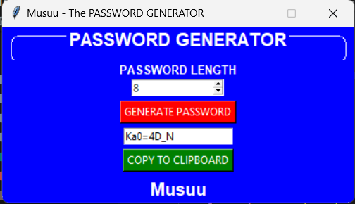

# 📄 Musuu - The PASSWORD GENERATOR

Welcome to **Musuu - The Password Generator**! 🔐 This project is a simple yet effective tool to generate strong, random passwords to keep your accounts secure. The user-friendly interface allows you to choose the length of your password and generates it with a single click. You can also easily copy the generated password to your clipboard. 

## 🎨 Features
- **Random Password Generation**: Create passwords containing uppercase letters, lowercase letters, digits, and special characters.
- **Customizable Length**: Choose the length of your password from 8 to 32 characters.
- **Easy Copy to Clipboard**: Quickly copy the generated password to your clipboard for easy pasting.

## 🖥️ Technology Used
- **Python**: The primary programming language used for this project.
- **Tkinter**: The standard GUI library for Python, used to create the user interface.
- **Random and String Libraries**: Used to generate the random password.
- **Pyperclip**: A cross-platform Python module for clipboard operations.

## 📷 Screenshots


## 🚀 Getting Started
1. **Clone the Repository**: Clone this repository to your local machine using `git clone <repo-link>`.
2. **Install Dependencies**: Install the required libraries using `pip install -r requirements.txt`.
3. **Run the Application**: Execute the script using `python password_generator.py`.

## 🛠️ Installation
```bash
pip install pyperclip
```
Ensure you have Python installed. If not, download and install it from [python.org](https://www.python.org/).

## 📞 Connect with Me
- [](https://www.linkedin.com/in/mustafa-pinjari-287625256/)
- [](https://github.com/MustafaPinjari)
- [](https://www.instagram.com/its_ur_musuuu)

Thank you for using Musuu - The Password Generator! If you have any feedback or suggestions, feel free to reach out. 🚀